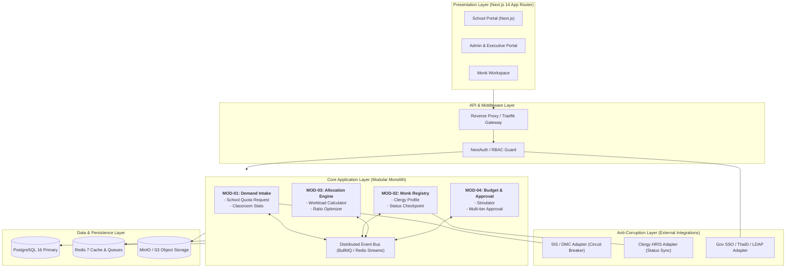
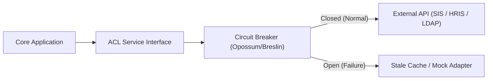

# System Architecture Blueprint
## ระบบประเมินและจัดสรรจำนวนพระสอนศีลธรรม (Moral Teaching Monk Quota & Evaluation System)

---

## 1. High-Level Architectural Pattern

ระบบใช้สถาปัตยกรรมแบบ **Event-Driven Modular Monolith** จัดการซอร์สโค้ดในรูปแบบ **Monorepo (Turborepo)** เพื่อรองรับการทำงานแบบ **Vibe Coding** ซึ่งต้องการ Codebase ที่กระชับ แชร์ Type Definition ได้แบบ Real-time และลด Overhead ในการติดตั้งระบบเครือข่ายระหว่าง Microservices



---

## 2. Directory Structure & Monorepo Layout

```text
moral-monk-system/
├── apps/
│   ├── web/                     # Next.js 14 Frontend Application
│   │   ├── app/                 # App Router (routes, layouts, server actions)
│   │   │   ├── (auth)/          # Login, Register, Forgot Password
│   │   │   ├── (school)/        # School Demand Intake Screens
│   │   │   ├── (admin)/         # Provincial & Central Management Dashboard
│   │   │   └── (monk)/          # Monk Profile & Assignment View
│   │   ├── components/          # UI Components (Shadcn UI wrappers)
│   │   └── lib/                 # Client utilities
│   │
│   └── worker/                  # Background Worker (BullMQ Job Processors)
│       ├── processors/          # Batch allocation & budget simulation jobs
│       └── scheduled/           # Daily status sync cron jobs
│
├── packages/
│   ├── contracts/               # Shared Zod Schemas & Event Definitions (Single Source of Truth)
│   │   ├── src/
│   │   │   ├── events/          # Strongly-typed Event schemas
│   │   │   ├── requests/        # DTO & Form Validation schemas
│   │   │   └── responses/       # API Output schemas
│   │
│   ├── database/                # Database configuration & ORM
│   │   ├── prisma/
│   │   │   ├── schema.prisma    # Complete database schema
│   │   │   └── migrations/      # Version-controlled DB migrations
│   │   └── src/                 # Prisma client instance & helpers
│   │
│   ├── ui/                      # Shared Tailwind & UI Design System
│   └── config/                  # Shared ESLint, Prettier, TypeScript configs
│
├── .env.example
├── turbo.json                   # Turborepo build & pipeline configuration
└── package.json
```

---

## 3. Module Boundaries & Cross-Module Communication

แต่ละโมดูลในระบบจะสื่อสารกันผ่าน **Event Contracts** ใน `packages/contracts` โดยไม่เรียก Query ข้ามตารางของโมดูลอื่นโดยตรง (Strict Decoupling):

1. **`MonkStatusChangedEvent`**:
   * **Publisher:** `MOD-02 (Monk Registry)`
   * **Consumers:** `MOD-03 (Allocation Engine)`, `MOD-04 (Budget Engine)`
   * **Payload:** `{ monkId: string, oldStatus: string, newStatus: string, schoolId?: string, timestamp: Date }`
2. **`SchoolDemandSubmittedEvent`**:
   * **Publisher:** `MOD-01 (Demand Intake)`
   * **Consumers:** `MOD-03 (Allocation Engine)`
   * **Payload:** `{ schoolId: string, academicYear: number, requestedSlots: number, studentCount: number }`
3. **`QuotaAllocationCalculatedEvent`**:
   * **Publisher:** `MOD-03 (Allocation Engine)`
   * **Consumers:** `MOD-04 (Budget Engine)`
   * **Payload:** `{ schoolId: string, allocatedSlots: number, isPriorityArea: boolean }`

---

## 4. Integration & Anti-Corruption Layer (ACL)

เพื่อป้องกันไม่ให้ข้อผิดพลาดจากระบบภายนอกส่งผลกระทบต่อระบบประเมินโควตา โมดูลภายนอกจะถูกห่อหุ้มด้วย **Anti-Corruption Layer (ACL)**:



* **SIS Connector:** ดึงข้อมูลสถิตินักเรียนและห้องเรียน หากระบบ สพฐ./DMC ไม่ตอบสนองภายใน 3 วินาที จะดึงข้อมูล Cached Snapshot ของปีก่อนหน้ามาแสดงผลพร้อมติดธงแจ้งเตือน
* **Clergy HRIS Connector:** ทำงานผ่าน Background Sync Job ทุกเที่ยงคืน เพื่อเปรียบเทียบสถานะสมณเพศ (Validation Checkpoint) หากล่ม จะอนุญาตให้บันทึกสถานะชั่วคราว (`PROVISIONAL`) ได้
* **SSO / LDAP Connector:** ถอดรหัส JWT จากระบบกลางภาครัฐ หากระบบกลางล่ม อนุญาตให้ใช้ Local Admin Break-glass Authentication ได้

---

## 5. Resilience & Fallback Architecture

| กรณีเกิดความผิดพลาด | ผลกระทบ | กลยุทธ์การแก้ไข (Fallback Mechanism) |
| :--- | :--- | :--- |
| **SIS API ดับสนิท** | โรงเรียนดึงจำนวนนักเรียนอัตโนมัติไม่ได้ | สลับเป็นโหมด **Manual Self-Declaration** โดยให้โรงเรียนแนบไฟล์ภาพถ่ายหนังสือรับรองยอดนักเรียน และส่งเข้าคิวรอตรวจ |
| **Redis Cache ล่ม** | คิวงาน BullMQ ไม่ทำงาน | ปรับเป็น **In-Memory Sequential Execution** สำหรับงานเร่งด่วน พร้อมแจ้งเตือนทีม Infrastructure ผ่าน Healthcheck endpoint |
| **Batch Calculation Timeout** | การคำนวณโควตาทั่วประเทศค้าง | แบ่งงานเป็นชิ้นเล็กระดับจังหวัด (Chunking per Province) โดยแต่ละชิ้นประมวลผลแยกอิสระและบันทึก State ลง DB |

---

## 6. Security & Data Protection Architecture

1. **Authentication & Session:** ใช้ NextAuth.js ร่วมกับ Database Sessions พร้อมเข้ารหัส Token
2. **Authorization (RBAC):** กำหนดระดับสิทธิ์ผ่าน Middleware และ Service Guard (School, Province, Central, Auditor)
3. **Data Encryption:**
   * **At-Rest:** ฐานข้อมูลเปิดใช้ PostgreSQL Transparent Data Encryption (TDE) หรือ pgcrypto เข้ารหัสข้อมูลอ่อนไหว (เลขประจำตัวประชาชน, รหัสประจำตัวพระ)
   * **In-Transit:** บังคับใช้ TLS 1.3 ในทุกการเชื่อมต่อภายนอกและภายใน
4. **Audit Trail Logging:** ตาราง `AuditLog` บันทึกการกระทำสำคัญทั้งหมด (ใคร, ทำอะไร, ข้อมูลก่อนเปลี่ยน, ข้อมูลหลังเปลี่ยน, IP Address, Timestamp) ในรูปแบบ Immutable Record ห้ามแก้ไขหรือลบ
