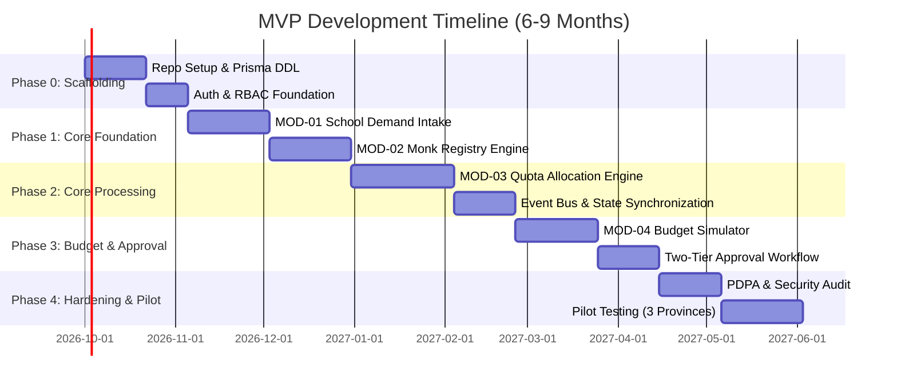

# Engineering Implementation Plan
## ระบบประเมินและจัดสรรจำนวนพระสอนศีลธรรม (Moral Teaching Monk Quota & Evaluation System)

---

## 1. Project Phase Roadmap (6–9 Months MVP)

---

## 2. Granular Task Breakdown

### Phase 0: Project Scaffolding & Shared Packages (Weeks 1–5)
- **TASK-001: Monorepo Scaffolding & Configuration**
  - **Details:** ติดตั้ง Turborepo พร้อมโครงสร้าง `apps/web`, `apps/worker`, `packages/database`, `packages/contracts`, `packages/ui`
  - **Target Files:** `turbo.json`, `package.json`, `packages/config/*`
  - **Verification:** คำสั่ง `pnpm build` และ `pnpm lint` ทำงานผ่านทุก Workspace
- **TASK-002: Database & Prisma Migration Scaffolding**
  - **Details:** จัดทำ `schema.prisma` ตามข้อกำหนดใน `schema.md` และสร้าง Initial Migration
  - **Target Files:** `packages/database/prisma/schema.prisma`, `migrations/*`
  - **Verification:** รัน `prisma migrate dev` และตรวจสอบ Table Creation ใน PostgreSQL
- **TASK-003: Shared Contracts & Zod Schemas**
  - **Details:** สร้าง DTO และ Event Definitions ใน `packages/contracts`
  - **Verification:** Unit test ตรวจสอบ Zod Schema Parsing สำหรับ Payload ที่ถูกต้องและไม่ถูกต้อง
- **TASK-004: NextAuth.js & RBAC Guard Implementation**
  - **Details:** วางระบบ Authenticate ผู้ใช้งาน 6 Role พร้อม Middleware ตรวจสอบสิทธิ์รายหน้าจอ
  - **Verification:** Login ด้วย Mock Users ครบทุก Role และทดสอบการเข้าถึง Route ที่ถูกจำกัดสิทธิ์

### Phase 1: Core Foundation (Weeks 6–13)
- **TASK-005: School Registry & Demand Submission UI (MOD-01)**
  - **Details:** พัฒนาแบบฟอร์มให้โรงเรียนยื่นคำขอโควตา พร้อมระบบคำนวณจำนวนห้องและนักเรียนอัตโนมัติ
  - **Target Files:** `apps/web/app/(school)/demand/page.tsx`, Server Actions
  - **Verification:** โรงเรียนสามารถสร้างคำขอ สถานะบันทึกเป็น `SUBMITTED` และไม่สามารถส่งคำขอซ้ำในปีการศึกษาเดียวกันได้
- **TASK-006: Excel Bulk Intake Fallback (MOD-01)**
  - **Details:** สร้างระบบ Import ข้อมูลคำขอจากไฟล์ Excel โดย Validate ผ่าน Zod
  - **Verification:** ทดสอบนำเข้าไฟล์ Excel ขนาด 500 โรงเรียน ข้อมูลเข้าสู่ฐานข้อมูลถูกต้องครบถ้วน
- **TASK-007: Monk Profile & Verification Engine (MOD-02)**
  - **Details:** ระบบบันทึกและสืบค้นประวัติพระสอนศีลธรรม ตรวจสอบความซ้ำซ้อนของเลขใบสุทธิและเลขบัตร
  - **Target Files:** `apps/web/app/(admin)/monks/page.tsx`
  - **Verification:** พยายามบันทึกพระรูปเดิมซ้ำ ระบบต้องแจ้งเตือนปฏิเสธ
- **TASK-008: Monk Status Invalidation & Event Dispatch (MOD-02)**
  - **Details:** ทำระบบปรับปรุงสถานะพระสงฆ์ (เช่น `DISROBED`, `TRANSFERRED`) พร้อม Publish `MonkStatusChangedEvent`
  - **Verification:** ตรวจสอบว่า Event ถูกส่งไปยัง BullMQ และบันทึก Audit Log สำเร็จ

### Phase 2: Allocation & Workload Engine (Weeks 14–21)
- **TASK-009: Workload Calculation Engine Implementation (MOD-03)**
  - **Details:** พัฒนาโมดูลคำนวณโควตาแนะนำ ($Q_{rec}$) ตามสูตรมาตรฐานและเพดานขนาดโรงเรียน
  - **Target Files:** `apps/worker/processors/allocation-calculator.ts`
  - **Verification:** รัน Unit Test ครอบคลุมเคส: โรงเรียนเล็ก (ได้ 1), โรงเรียนขยายโอกาส (ได้ตัวคูณ 1.2), โรงเรียนใหญ่เกิน Cap (ไม่เกินเพดาน)
- **TASK-010: Allocation Conflict & Overload Prevention (MOD-03)**
  - **Details:** กฎตรวจสอบไม่ให้พระ 1 รูป มีภาระงานสอนเกิน 20 คาบ หรือลงสอนชนเวลากัน
  - **Verification:** ทดสอบ Assign พระที่มีภาระงาน 18 คาบ ไปยังโรงเรียนที่ขอ 4 คาบ ระบบต้องปฏิเสธ
- **TASK-011: Automated Slot Vacancy Handler (MOD-03)**
  - **Details:** Worker ดักจับ `MonkStatusChangedEvent` เพื่อปลดโควตาของโรงเรียนนั้นเป็น `SLOT_VACANT` อัตโนมัติ
  - **Verification:** เมื่อพระถูกเปลี่ยนเป็นลาสิกขา โควตาของโรงเรียนนั้นต้องเปลี่ยนเป็นว่างทันที

### Phase 3: Budget Simulation & Approval Workflow (Weeks 22–28)
- **TASK-012: Budget Ledger & Real-time Aggregator (MOD-04)**
  - **Details:** คำนวณผลรวมเงินนิตยภัตรายเดือน/รายปี ผูกกับโควตาที่จัดสรรแล้ว
  - **Verification:** ทดสอบปรับเปลี่ยนจำนวนโควตา ยอดรวมงบประมาณต้องอัปเดตแบบ Dynamic
- **TASK-013: What-If Scenario Simulator (MOD-04)**
  - **Details:** พัฒนาหน้าจอ Interactive ให้ผู้บริหารเลื่อน Slider ปรับลดงบประมาณ และระบบจำลองผลกระทบ
  - **Verification:** ปรับลดงบประมาณ 10% ระบบต้องแสดงรายชื่อโควตาที่ถูกตัดลดตามเกณฑ์ Priority อัตโนมัติ
- **TASK-014: Two-Tier Approval Flow & Audit Signing (MOD-04)**
  - **Details:** เวิร์กโฟลว์ส่งต่อ: โรงเรียน $\rightarrow$ จังหวัดเห็นชอบ $\rightarrow$ ส่วนกลางอนุมัติขั้นสุดท้าย พร้อม Hash Stamp
  - **Verification:** ทดสอบอนุมัติข้ามขั้นตอน ระบบต้องปฏิเสธ และเมื่ออนุมัติสำเร็จต้องดาวน์โหลด PDF สรุปยอดได้

### Phase 4: Security Hardening & Pilot (Weeks 29–36)
- **TASK-015: PDPA Compliance & PII Masking**
  - **Details:** ซ่อนเลขบัตรประชาชนในหน้าจอทั่วไป และเข้ารหัส Field อ่อนไหวในระดับ Database
- **TASK-016: Stress & Load Testing**
  - **Details:** รัน k6 จำลอง Concurrent Users 1,500 CCU ในช่วงยื่นคำขอ
- **TASK-017: Pilot Deployment (3 จังหวัดนำร่อง)**
  - **Details:** ติดตั้งระบบบน Staging Environment เพื่อทดลองใช้งานจริงกับโรงเรียน 300 แห่ง

---

## 3. Definition of Done (DoD) สำหรับแต่ละ Task

ก่อนที่ AI Agent หรือ Developer จะทำเครื่องหมายว่า Task ใด "Done" จะต้องผ่านเกณฑ์ดังนี้:
1. **Type Safety:** รัน `pnpm typecheck` ผ่าน 100% โดยไม่มี `any` หรือ `@ts-ignore`
2. **Automated Tests:** มี Unit Test ครอบคลุม Business Logic และรัน `pnpm test` ผ่าน
3. **Database Integrity:** Foreign Key และ Constraints ทุกจุดไม่เกิด Orphan Records
4. **Audit Trail:** การแก้ไข State หรือข้อมูลสำคัญต้องมีการเขียนลง `AuditLog`
5. **Documentation & Changelog:** อัปเดตสถานะใน `progress.md` พร้อมระบุขอบเขตสิ่งที่ทำ
