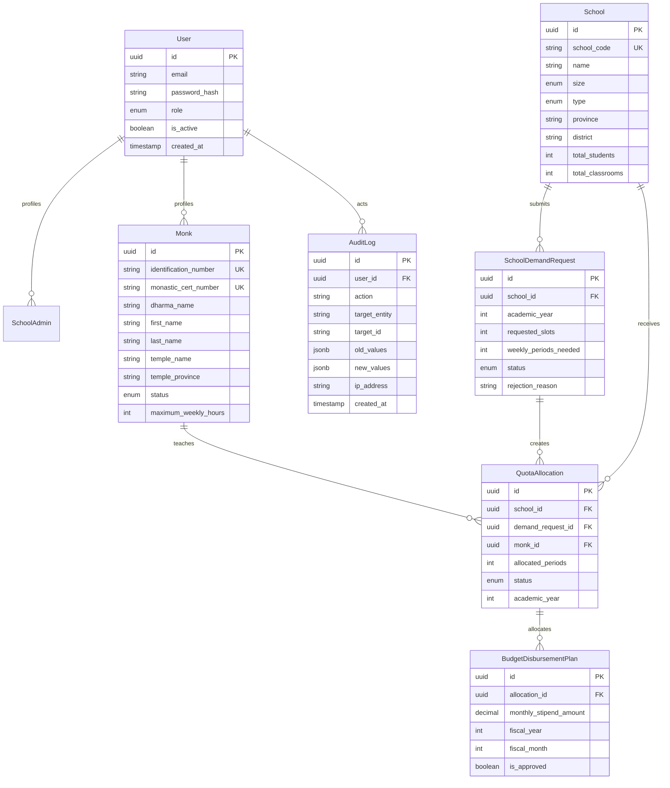

# Data Model & Schema Specification
## ระบบประเมินและจัดสรรจำนวนพระสอนศีลธรรม (Moral Teaching Monk Quota & Evaluation System)

---

## 1. Database Overview & Strategy

* **RDBMS Engine:** PostgreSQL 16
* **ORM:** Prisma ORM 5+ (Strict Type Generation)
* **Naming Conventions:**
  * ตารางและคอลัมน์ใช้ `snake_case` ในระดับฐานข้อมูล และ Map เป็น `camelCase` ในระดับ Prisma/TypeScript
  * Primary Key ทุกตารางใช้ UUIDv4 (`@default(uuid())`) เพื่อความปลอดภัยและรองรับการขยายตัว
  * ทุกตารางหลักต้องมี Audit Columns: `created_at`, `updated_at`, และ `deleted_at` (Soft Delete)

---

## 2. Core Enums

```prisma
enum UserRole {
  SCHOOL_ADMIN        // ครู/ผู้บริหารสถานศึกษา
  MONK                // พระสอนศีลธรรม
  PROVINCIAL_OFFICER  // เจ้าหน้าที่ประสานงานระดับจังหวัด/อำเภอ
  CENTRAL_ADMIN       // เจ้าหน้าที่ส่วนกลาง (มจร/มมร/พศ.)
  EXECUTIVE           // ผู้บริหารระดับสูง (ผู้อนุมัติขั้นสุดท้าย)
  AUDITOR             // ผู้ตรวจสอบ (สตง. / สตส.)
}

enum MonkStatus {
  ACTIVE              // ปฏิบัติการสอนตามปกติ
  LEAVE_TEMPORARY     // พักการสอนชั่วคราว (เช่น ติดศาสนกิจ/อาพาธ)
  TRANSFERRED         // ย้ายสังกัดวัด/ย้ายพื้นที่
  DISROBED            // ลาสิกขาแล้ว (สิ้นสุดสภาพทันที)
  DECEASED            // มรณภาพ
  PROVISIONAL         // บันทึกเบื้องต้น รอผลการตรวจสอบสถานะกับระบบกลาง
}

enum SchoolSize {
  SMALL               // นักเรียน <= 120 คน
  MEDIUM              // นักเรียน 121 - 300 คน
  LARGE               // นักเรียน 301 - 1,000 คน
  EXTRA_LARGE         // นักเรียน > 1,000 คน
}

enum SchoolType {
  GENERAL             // โรงเรียนทั่วไป
  OPPORTUNITY_EXPAND  // โรงเรียนขยายโอกาส
  REMOTE_BORDER       // โรงเรียนพื้นที่ห่างไกล/ชายขอบ/ทุรกันดาร
}

enum DemandRequestStatus {
  DRAFT               // แบบร่าง ยังไม่ส่ง
  SUBMITTED           // ส่งคำขอแล้ว รอจังหวัดตรวจสอบ
  PROVINCE_APPROVED   // จังหวัดเห็นชอบแล้ว
  REVISE_REQUESTED    // ส่งกลับให้แก้ไขข้อมูล
  REJECTED            // ปฏิเสธคำขอ
  FINAL_APPROVED      // อนุมัติรอบสุดท้ายโดยส่วนกลาง
}

enum AllocationStatus {
  UNASSIGNED          // ได้รับโควตา แต่ยังไม่ระบุตัวพระสงฆ์
  ASSIGNED            // ระบุตัวพระสงฆ์เรียบร้อย
  SLOT_VACANT         // เดิมเคยมีพระสอน แต่พระลาสิกขา/ย้าย จึงว่างลง
  CANCELLED           // ยกเลิกโควตานี้
}
```

---

## 3. Entity Relationship Diagram (ERD)



---

## 4. Prisma Schema DDL Specification

```prisma
// packages/database/prisma/schema.prisma

datasource db {
  provider = "postgresql"
  url      = env("DATABASE_URL")
}

generator client {
  provider = "prisma-client-js"
}

model User {
  id           String     @id @default(uuid()) @db.Uuid
  email        String     @unique @db.VarChar(255)
  passwordHash String     @map("password_hash") @db.VarChar(255)
  fullName     String     @map("full_name") @db.VarChar(255)
  role         UserRole   @default(SCHOOL_ADMIN)
  isActive     Boolean    @default(true) @map("is_active")
  createdAt    DateTime   @default(now()) @map("created_at")
  updatedAt    DateTime   @updatedAt @map("updated_at")
  deletedAt    DateTime?  @map("deleted_at")

  monk         Monk?
  auditLogs    AuditLog[]

  @@map("users")
}

model School {
  id              String      @id @default(uuid()) @db.Uuid
  schoolCode      String      @unique @map("school_code") @db.VarChar(50)
  name            String      @db.VarChar(255)
  size            SchoolSize  @default(MEDIUM)
  type            SchoolType  @default(GENERAL)
  province        String      @db.VarChar(100)
  district        String      @db.VarChar(100)
  subDistrict     String      @map("sub_district") @db.VarChar(100)
  totalStudents   Int         @default(0) @map("total_students")
  totalClassrooms Int         @default(0) @map("total_classrooms")
  createdAt       DateTime    @default(now()) @map("created_at")
  updatedAt       DateTime    @updatedAt @map("updated_at")
  deletedAt       DateTime?   @map("deleted_at")

  demands         SchoolDemandRequest[]
  allocations     QuotaAllocation[]

  @@index([province, district])
  @@map("schools")
}

model Monk {
  id                   String     @id @default(uuid()) @db.Uuid
  userId               String?    @unique @map("user_id") @db.Uuid
  identificationNumber String     @unique @map("identification_number") @db.VarChar(20) // Encrypted in storage
  monasticCertNumber   String     @unique @map("monastic_cert_number") @db.VarChar(50) // เลขใบสุทธิ
  dharmaName           String     @map("dharma_name") @db.VarChar(100) // ฉายา
  firstName            String     @map("first_name") @db.VarChar(100)
  lastName             String     @map("last_name") @db.VarChar(100)
  templeName           String     @map("temple_name") @db.VarChar(255)
  templeProvince       String     @map("temple_province") @db.VarChar(100)
  dharmaEducationLevel String?    @map("dharma_education_level") @db.VarChar(100) // นักธรรม/เปรียญธรรม
  secularEducation     String?    @map("secular_education") @db.VarChar(100) // วุฒิทางโลก
  status               MonkStatus @default(PROVISIONAL)
  maxWeeklyHours       Int        @default(20) @map("max_weekly_hours")
  createdAt            DateTime   @default(now()) @map("created_at")
  updatedAt            DateTime   @updatedAt @map("updated_at")
  deletedAt            DateTime?  @map("deleted_at")

  user                 User?      @relation(fields: [userId], references: [id])
  allocations          QuotaAllocation[]

  @@index([status, templeProvince])
  @@map("monks")
}

model SchoolDemandRequest {
  id                   String              @id @default(uuid()) @db.Uuid
  schoolId             String              @map("school_id") @db.Uuid
  academicYear         Int                 @map("academic_year")
  requestedSlots       Int                 @map("requested_slots")
  weeklyPeriodsNeeded  Int                 @map("weekly_periods_needed")
  justificationNotes   String?             @map("justification_notes") @db.Text
  status               DemandRequestStatus @default(DRAFT)
  reviewedByProvinceAt DateTime?           @map("reviewed_by_province_at")
  reviewedByCentralAt  DateTime?           @map("reviewed_by_central_at")
  rejectionReason      String?             @map("rejection_reason") @db.Text
  createdAt            DateTime            @default(now()) @map("created_at")
  updatedAt            DateTime            @updatedAt @map("updated_at")

  school               School              @relation(fields: [schoolId], references: [id])
  allocations          QuotaAllocation[]

  @@unique([schoolId, academicYear])
  @@index([academicYear, status])
  @@map("school_demand_requests")
}

model QuotaAllocation {
  id                 String           @id @default(uuid()) @db.Uuid
  schoolId           String           @map("school_id") @db.Uuid
  demandRequestId    String           @map("demand_request_id") @db.Uuid
  monkId             String?          @map("monk_id") @db.Uuid
  academicYear       Int              @map("academic_year")
  allocatedPeriods   Int              @default(0) @map("allocated_periods")
  status             AllocationStatus @default(UNASSIGNED)
  createdAt          DateTime         @default(now()) @map("created_at")
  updatedAt          DateTime         @updatedAt @map("updated_at")

  school             School           @relation(fields: [schoolId], references: [id])
  demandRequest      SchoolDemandRequest @relation(fields: [demandRequestId], references: [id])
  monk               Monk?            @relation(fields: [monkId], references: [id])
  disbursementPlans  BudgetDisbursementPlan[]

  @@index([academicYear, status])
  @@map("quota_allocations")
}

model BudgetDisbursementPlan {
  id                   String          @id @default(uuid()) @db.Uuid
  allocationId         String          @map("allocation_id") @db.Uuid
  fiscalYear           Int             @map("fiscal_year")
  fiscalMonth          Int             @map("fiscal_month") // 1-12
  monthlyStipendAmount Decimal         @map("monthly_stipend_amount") @db.Decimal(10, 2)
  isApproved           Boolean         @default(false) @map("is_approved")
  createdAt            DateTime        @default(now()) @map("created_at")
  updatedAt            DateTime        @updatedAt @map("updated_at")

  allocation           QuotaAllocation @relation(fields: [allocationId], references: [id])

  @@unique([allocationId, fiscalYear, fiscalMonth])
  @@map("budget_disbursement_plans")
}

model AuditLog {
  id           String    @id @default(uuid()) @db.Uuid
  userId       String?   @map("user_id") @db.Uuid
  action       String    @db.VarChar(100) // e.g. MONK_STATUS_UPDATED, QUOTA_APPROVED
  targetEntity String    @map("target_entity") @db.VarChar(100)
  targetId     String    @map("target_id") @db.VarChar(100)
  oldValues    Json?     @map("old_values")
  newValues    Json?     @map("new_values")
  ipAddress    String?   @map("ip_address") @db.VarChar(50)
  createdAt    DateTime  @default(now()) @map("created_at")

  user         User?     @relation(fields: [userId], references: [id])

  @@index([targetEntity, targetId])
  @@index([createdAt])
  @@map("audit_logs")
}
```

---

## 5. Shared Zod Contracts & Event Payloads

```typescript
// packages/contracts/src/events/monk-events.ts
import { z } from "zod";

export const MonkStatusChangedEventSchema = z.object({
  eventId: z.string().uuid(),
  monkId: z.string().uuid(),
  identificationNumber: z.string(),
  oldStatus: z.enum(["ACTIVE", "LEAVE_TEMPORARY", "TRANSFERRED", "DISROBED", "DECEASED", "PROVISIONAL"]),
  newStatus: z.enum(["ACTIVE", "LEAVE_TEMPORARY", "TRANSFERRED", "DISROBED", "DECEASED", "PROVISIONAL"]),
  reason: z.string().optional(),
  occurredAt: z.string().datetime(),
  operatorUserId: z.string().uuid()
});

export type MonkStatusChangedEvent = z.infer<typeof MonkStatusChangedEventSchema>;

// packages/contracts/src/requests/demand-intake.ts
export const SubmitSchoolDemandSchema = z.object({
  schoolId: z.string().uuid(),
  academicYear: z.number().int().min(2560).max(2600),
  requestedSlots: z.number().int().min(1).max(10),
  weeklyPeriodsNeeded: z.number().int().min(1).max(100),
  totalStudentsReported: z.number().int().min(1),
  totalClassroomsReported: z.number().int().min(1),
  justificationNotes: z.string().max(1000).optional()
});

export type SubmitSchoolDemandInput = z.infer<typeof SubmitSchoolDemandSchema>;
```
